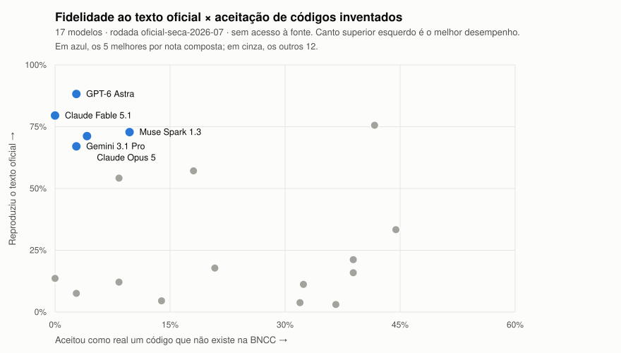

# bncc-benchmark

[](https://github.com/bncc-dev/bncc-benchmark/actions/workflows/validacao.yml)
[](LICENSE-DADOS.md)
[](LICENSE-CODIGO.md)
[](RELEASES.md)

Benchmark público de alucinação de LLMs sobre a BNCC (Base Nacional Comum
Curricular). Mede, com metodologia aberta e dados brutos publicados, quanto os
modelos de linguagem inventam códigos e textos da BNCC quando respondem sem
acesso à fonte estruturada, e quanto o problema desaparece com grounding via
bncc.dev (MCP e API).

A rodada `oficial-seca-2026-09` mediu **19 modelos × 900 respostas cada**, e as
17.100 respostas cruas estão neste repositório, uma a uma.

## Resultados

Pergunte a um LLM o texto exato de uma habilidade da BNCC, sem dar acesso à
fonte. A taxa de respostas fiéis ao texto oficial vai de **88% a 3%**,
dependendo do modelo.

| # | Modelo | Nota | Texto fiel | Aceitou código falso |
|---|---|---|---|---|
| 1 | GPT-6 Astra · OpenAI | 94,7 | 88% | 3% |
| 2 | Claude Fable 5.1 · Anthropic | 81,8 | 80% | 0% |
| 3 | Muse Spark 1.3 · Meta | 79,4 | 73% | 10% |
| 4 | Gemini 3.1 Pro · Google | 78,0 | 67% | 3% |
| 5 | Claude Opus 5 · Anthropic | 76,8 | 71% | 4% |

*Nota* é a média de cinco dimensões (reconhecer códigos reais, recusar falsos,
fidelidade do texto, lookup inverso e citação correta em geração aberta).
*Texto fiel* é a fração de respostas que reproduzem a habilidade oficial na
tarefa A. *Aceitou código falso* é a fração de códigos inexistentes — e
verificados como inexistentes também fora da BNCC — que o modelo afirmou
existir.

Os 19 modelos, todas as métricas e os exemplos estão em
[`resultados/`](resultados/) e no leaderboard em [bncc.dev](https://bncc.dev).

<picture>
  <source media="(prefers-color-scheme: dark)" srcset="resultados/oficial-seca-2026-09/site/dispersao-v0.3.0-escuro.svg">
  
</picture>

Duas leituras que o ranking sozinho não dá. **Acertar o texto e recusar
invenções são habilidades distintas** — por isso os pontos se espalham em vez
de formar uma diagonal. GPT-5.6 Luna e Claude Fable 5.1 reproduzem o texto
oficial com fidelidade parecida (76% e 80%), mas o primeiro aceita 42% dos
códigos inventados e o segundo, nenhum. E **não acertar não é tudo igual**: na
tarefa de transcrever uma habilidade, o benchmark separa quem inventa texto,
quem nega que o código exista e quem recusa responder. Claude Sonnet 5 e
Claude Haiku 4.5 têm nota baixa, mas recusam 36% e 37% das perguntas em vez
de inventar; Qwen 3.8 Flash, com nota parecida, inventa em 86%. A nota premia
quem acerta; as outras taxas saem lado a lado.

O gráfico é gerado a partir do leaderboard publicado
(`pnpm exportar-grafico`), não desenhado à mão: ele não tem como divergir dos
números da tabela.

## Por que esta rodada recomeça a série

A rodada de setembro (v0.3.0) mudou três coisas ao mesmo tempo: passou a
chamar **as APIs diretas de cada empresa** em vez de um agregador, passou a
usar **execução em lote** em sete modelos, e renovou sete vagas do elenco.
Por isso **as notas não são comparáveis com a v0.2.0**, e o leaderboard
recomeça aqui como a primeira fotografia da série nova (ver `DECISOES.md`
D15 e a entrada da release).

A rota direta não muda a régua, e isso foi medido: nos mesmos 300 itens, os
modelos que trocaram de rota concordaram com a medição anterior entre 79% e
90% dos vereditos, dentro da faixa dos que **não** trocaram (86% a 98%). O
que a rota direta muda é a fidelidade do que chega ao modelo: pelo agregador,
parâmetros como temperatura eram traduzidos em silêncio, e o benchmark não
tinha como saber.

Esta release também corrigiu a rubrica do juiz. Até a v0.2.0, um modelo que
recusava responder, ou que negava que o código existisse, era contado como se
tivesse inventado texto. Nesta rodada são 476 recusas e 207 negações em 5.016
respostas — e 195 dessas negações são de Computação: vários modelos afirmam
que "CO" não é componente da BNCC, porque não conhecem o complemento de 2022.
A correção derrubou pela metade a taxa de alucinação dos modelos que recusam,
quase sem mexer no ranking. As releases anteriores não são reescritas, e a
ressalva está em [`RELEASES.md`](RELEASES.md).

Metodologia completa em [`METODOLOGIA.md`](METODOLOGIA.md), decisões de desenho
numeradas em [`DECISOES.md`](DECISOES.md), composição de cada release em
[`RELEASES.md`](RELEASES.md).

## Com acesso à fonte: o estudo de intervenção

A rodada grounded prometida nas duas primeiras releases foi feita como
**estudo de intervenção**, em série própria, porque não é um ranking: a fonte
de grounding (o MCP do bncc.dev) e o gabarito são o mesmo dataset, mantido
por nós, e um modelo que consulta e copia acerta por construção. O que se
mede é o **efeito do acesso ao dado**, com uma condição de controle (o dado
colado no prompt, sem ferramenta) para separar o mérito do dado do mérito do
instrumento.

Resultado (8 modelos, 300 itens, três condições pareadas, pré-registro
fechado antes da bateria): sem fonte, **31,9%** das respostas têm alucinação;
com o dado no prompt, **0,2%**; consultando o MCP, **2,3%**. A queda vale
para todos os modelos (média de 30,6 pontos; IC 95% por bootstrap por item).
Os erros que sobram estão em dois modelos pequenos e numa tarefa (dado o
texto, achar o código), e metade deles sumiu quando o estudo revelou dois
defeitos na busca do próprio servidor, corrigidos e re-medidos.

Relatório completo, ressalvas por modelo e artefatos auditáveis: Release
[`estudo-fonte-v0.1.0`](https://github.com/bncc-dev/bncc-benchmark/releases/tag/estudo-fonte-v0.1.0)
e `resultados/estudo-fonte-2026-08/`. Decisões: `DECISOES.md` D14 e D14.1.

## O conjunto held-out

Além do banco público, existe um conjunto de itens gerado pelo mesmo pipeline
que **nunca é publicado**. Ele existe porque publicar um benchmark o expõe a ser
absorvido no treino dos modelos: daqui a um ano, um modelo pode ir bem nos itens
públicos porque aprendeu BNCC ou porque decorou esta prova, e olhando só para
eles não há como distinguir. O held-out é a contraprova — melhora nos dois
conjuntos indica aprendizado; melhora só no público indica memorização.

Por isso ele não será liberado, nem sob pedido, e dele publicamos apenas
resultados agregados. Ver [`DECISOES.md`](DECISOES.md) D5.

## O que é medido

Quatro tipos de alucinação, quatro tarefas:

| Tarefa | Pergunta típica | Mede |
|---|---|---|
| A · lookup direto | "Qual é o texto da habilidade EF67LP08?" | texto inventado ou trocado (T2) |
| B · existência | "A habilidade X existe na BNCC? Sim ou não." | aceitação de códigos falsos-plausíveis (T4) |
| C · geração aberta | "Liste 5 habilidades de Matemática do 7º ano, com código e texto." | códigos inventados em uso real (T1, T2, T3) |
| D · lookup inverso | "Qual é o código desta habilidade?" (dado o texto) | memorização na direção inversa |

O gabarito é o dataset verificado do bncc.dev (`@bncc/dados`, 1.721
aprendizagens, cada uma rastreável ao documento oficial). Os códigos
falsos-plausíveis da tarefa B são construídos a partir das lacunas legítimas
da numeração oficial, que só o dataset conhece.

## Estrutura

```
harness/          código do benchmark (gerador de itens, runner, avaliação, agregação)
itens/            banco de itens versionado
resultados/       respostas brutas (JSONL) e agregados, por rodada
METODOLOGIA.md    protocolo completo
DECISOES.md       decisões de desenho numeradas
```

Como as peças se encaixam, e a receita para **adicionar um modelo**:
[`docs/arquitetura.md`](docs/arquitetura.md).

## Uso

Instalação do zero e primeira execução: [`docs/comecando.md`](docs/comecando.md).

```bash
pnpm install
pnpm test                                  # invariantes do gerador + verificadores
pnpm gerar                                 # gera itens/itens-v1-rc.json (determinístico)
pnpm executar --rodada smoke --modelos claude-haiku --limite 10
pnpm avaliar --rodada smoke
pnpm agregar --rodada smoke
pnpm agregar --rodada smoke --verificar   # o check que o CI usa
```

Keys dos provedores em `.env` (nunca commitadas). A execução é sempre local;
o CI roda apenas typecheck, testes e o check de consistência dos resultados.

## Quem mantém

O bncc.dev é mantido pela [Profy](https://www.profy.ai/). Vale declarar o
conflito de interesse: a Profy opera produtos que usam LLMs sobre a BNCC, e este
benchmark mede LLMs sobre a BNCC. A resposta a isso é o desenho — metodologia,
itens, respostas cruas e julgamentos são todos públicos e recalculáveis, e o
CI reprova qualquer nota editada à mão.

A triagem que precedeu a rodada oficial, aliás, encontrou uma habilidade com
texto inventado publicada **no próprio site da Profy**
([registro](docs/pre-triagem/2026-07-15-triagem-falsos.md)). Está
documentado aqui pelo mesmo motivo que todo o resto está.

## Como contribuir

Este é um instrumento de medição, então a regra é diferente da de um projeto
comum: **rodadas publicadas são imutáveis** e itens não são corrigidos por PR —
a correção entra na próxima versão do banco. Leia
[`CONTRIBUTING.md`](CONTRIBUTING.md) antes de abrir qualquer coisa. Melhorias no
harness, avaliador, exportadores e documentação são bem-vindas pelo caminho
normal.

Problemas de segurança e suspeita de vazamento do held-out: canal privado em
[`SECURITY.md`](SECURITY.md), nunca em issue pública.

## Licenças

Código: MIT ([`LICENSE-CODIGO.md`](LICENSE-CODIGO.md)). Itens, resultados e
metodologia: CC BY 4.0 ([`LICENSE-DADOS.md`](LICENSE-DADOS.md)). Resumo em
[`LICENSE`](LICENSE); condições de reuso das respostas dos modelos em
[`resultados/README.md`](resultados/README.md).
