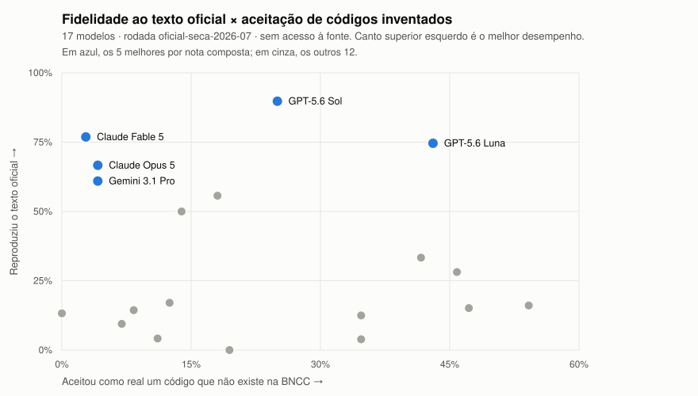

# bncc-benchmark

[](https://github.com/bncc-dev/bncc-benchmark/actions/workflows/validacao.yml)
[](LICENSE-DADOS.md)
[](LICENSE-CODIGO.md)
[](RELEASES.md)

Benchmark público de alucinação de LLMs sobre a BNCC (Base Nacional Comum
Curricular). Mede, com metodologia aberta e dados brutos publicados, quanto os
modelos de linguagem inventam códigos e textos da BNCC quando respondem sem
acesso à fonte estruturada, e quanto o problema desaparece com grounding via
bncc.dev (MCP e API).

A rodada `oficial-seca-2026-08` mediu **19 modelos × 900 respostas cada**, e as
17.100 respostas cruas estão neste repositório, uma a uma.

## Resultados

Pergunte a um LLM o texto exato de uma habilidade da BNCC, sem dar acesso à
fonte. A taxa de respostas fiéis ao texto oficial vai de **90% a 0%**,
dependendo do modelo.

| # | Modelo | Nota | Texto fiel | Aceitou código falso |
|---|---|---|---|---|
| 1 | GPT-5.6 Sol · OpenAI | 86,4 | 90% | 25% |
| 2 | Claude Fable 5 · Anthropic | 80,2 | 77% | 3% |
| 3 | Gemini 3.1 Pro · Google | 76,0 | 61% | 4% |
| 4 | Claude Opus 5 · Anthropic | 75,0 | 67% | 4% |
| 5 | GPT-5.6 Luna · OpenAI | 73,8 | 75% | 43% |

*Nota* é a média de cinco dimensões (reconhecer códigos reais, recusar falsos,
fidelidade do texto, lookup inverso e citação correta em geração aberta).
*Texto fiel* é a fração de respostas que reproduzem a habilidade oficial na
tarefa A. *Aceitou código falso* é a fração de códigos inexistentes — e
verificados como inexistentes também fora da BNCC — que o modelo afirmou
existir.

Os 19 modelos, todas as métricas e os exemplos estão em
[`resultados/`](resultados/) e no leaderboard em [bncc.dev](https://bncc.dev).

<picture>
  <source media="(prefers-color-scheme: dark)" srcset="resultados/oficial-seca-2026-08/site/dispersao-v0.2.0-escuro.svg">
  
</picture>

Duas leituras que o ranking sozinho não dá. **Nota alta não significa modelo
confiável**: o primeiro colocado ainda aceita 25% dos códigos falsos como
reais. E **acertar o texto e recusar invenções são habilidades distintas** —
por isso os pontos se espalham em vez de formar uma diagonal. GPT-5.6 Luna e
Claude Fable 5 reproduzem o texto oficial com fidelidade parecida (75% e 77%),
mas o primeiro aceita 43% dos códigos inventados e o segundo, 3% — quatorze
vezes menos, com a mesma competência de texto.

O gráfico é gerado a partir do leaderboard publicado
(`pnpm exportar-grafico`), não desenhado à mão: ele não tem como divergir dos
números da tabela.

## Um mês depois: o que mudou entre as rodadas

A rodada de julho (v0.1.0) mediu 17 modelos; a de agosto, 19. Comparar as duas
exige separar três situações diferentes — o identificador de um modelo designa
**aquele modelo**, não uma vaga no elenco, então "o kimi melhorou" seria uma
leitura errada quando o que houve foi troca de geração (ver `DECISOES.md` D13).

**Mesmo modelo, mesma condição.** Nove modelos foram remedidos do zero, com
chamadas novas:

| Modelo | Julho | Agosto | Δ |
|---|---|---|---|
| GPT-5.6 Sol | 89,2 | 86,4 | −2,8 |
| GPT-5.6 Luna | 75,3 | 73,8 | −1,5 |
| Gemini 3.1 Pro | 77,0 | 76,0 | −1,1 |
| Claude Fable 5 | 81,3 | 80,2 | −1,0 |
| Sabiá-4 · Sonnet 5 · Sonnet 4.6 · Haiku 4.5 | — | — | ±0,1 |
| Sabiazinho-4 | 27,3 | 29,1 | +1,8 |

Todos dentro de ±3 pontos, quatro deles dentro de ±0,1. **É o resultado mais
importante desta comparação**: um mês depois, com cache novo e chamadas
frescas, a régua dá a mesma medida. Sem isso, nenhuma das outras comparações
significaria nada.

**Geração nova na mesma vaga.** Aqui são modelos diferentes, e a diferença
mede o que a empresa entregou na versão seguinte:

| Vaga | Julho | Agosto | Δ |
|---|---|---|---|
| Google econômico | Gemini 3.5 Flash · 41,4 | Gemini 3.7 Flash · 70,9 | **+29,5** |
| Anthropic topo | Claude Opus 4.8 · 45,7 | Claude Opus 5 · 75,0 | **+29,3** |
| Moonshot topo | Kimi K2.6 · 30,4 | Kimi K3 · 43,8 | +13,5 |
| xAI topo | Grok 4.5 · 48,0 | Grok 4.6 · 54,5 | +6,6 |
| Alibaba topo | Qwen 3.7 Max · 44,3 | Qwen 3.8 Max · 43,0 | −1,3 |

Duas gerações novas saltaram ~30 pontos em um mês; uma andou para trás. Não há
tendência única — depende da empresa.

**Entrantes**: Muse Spark 1.2 (Meta) estreia em 7º com 70,6; Qwen 3.7 Flash
entra em 19º com 27,3.

Ficam de fora da comparação os três modelos cuja *condição de medição* mudou
junto (snapshot datado ou orçamento de tokens): DeepSeek V4 Pro, V4 Flash e
Qwen 3.7 Plus. As ressalvas estão em [`RELEASES.md`](RELEASES.md).

Metodologia completa em [`METODOLOGIA.md`](METODOLOGIA.md), decisões de desenho
numeradas em [`DECISOES.md`](DECISOES.md), composição de cada release em
[`RELEASES.md`](RELEASES.md).

## O conjunto held-out

Além do banco público, existe um conjunto de itens gerado pelo mesmo pipeline
que **nunca é publicado**. Ele existe porque publicar um benchmark o expõe a ser
absorvido no treino dos modelos: daqui a um ano, um modelo pode ir bem nos itens
públicos porque aprendeu BNCC ou porque decorou esta prova, e olhando só para
eles não há como distinguir. O held-out é a contraprova — melhora nos dois
conjuntos indica aprendizado; melhora só no público indica memorização.

Por isso ele não será liberado, nem sob pedido, e dele publicamos apenas
resultados agregados. Ver [`DECISOES.md`](DECISOES.md) D5.

## Quem mantém

O bncc.dev é mantido pela [Profy](https://www.profy.ai/). Vale declarar o
conflito de interesse: a Profy opera produtos que usam LLMs sobre a BNCC, e este
benchmark mede LLMs sobre a BNCC. A resposta a isso é o desenho — metodologia,
itens, respostas cruas e julgamentos são todos públicos e recalculáveis, e o
CI reprova qualquer nota editada à mão.

A triagem que precedeu a rodada oficial, aliás, encontrou uma habilidade com
texto inventado publicada **no próprio site da Profy**
([registro](docs/pre-triagem/2026-07-15-triagem-falsos.md)). Está
documentado aqui pelo mesmo motivo que todo o resto está.

## O que é medido

Quatro tipos de alucinação, quatro tarefas:

| Tarefa | Pergunta típica | Mede |
|---|---|---|
| A · lookup direto | "Qual é o texto da habilidade EF67LP08?" | texto inventado ou trocado (T2) |
| B · existência | "A habilidade X existe na BNCC? Sim ou não." | aceitação de códigos falsos-plausíveis (T4) |
| C · geração aberta | "Liste 5 habilidades de Matemática do 7º ano, com código e texto." | códigos inventados em uso real (T1, T2, T3) |
| D · lookup inverso | "Qual é o código desta habilidade?" (dado o texto) | memorização na direção inversa |

O gabarito é o dataset verificado do bncc.dev (`@bncc/dados`, 1.721
aprendizagens, cada uma rastreável ao documento oficial). Os códigos
falsos-plausíveis da tarefa B são construídos a partir das lacunas legítimas
da numeração oficial, que só o dataset conhece.

## Estrutura

```
harness/          código do benchmark (gerador de itens, runner, avaliação, agregação)
itens/            banco de itens versionado
resultados/       respostas brutas (JSONL) e agregados, por rodada
METODOLOGIA.md    protocolo completo
DECISOES.md       decisões de desenho numeradas
```

Como as peças se encaixam, e a receita para **adicionar um modelo**:
[`docs/arquitetura.md`](docs/arquitetura.md).

## Uso

Instalação do zero e primeira execução: [`docs/comecando.md`](docs/comecando.md).

```bash
pnpm install
pnpm test                                  # invariantes do gerador + verificadores
pnpm gerar                                 # gera itens/itens-v1-rc.json (determinístico)
pnpm executar --rodada smoke --modelos claude-haiku --limite 10
pnpm avaliar --rodada smoke
pnpm agregar --rodada smoke
pnpm agregar --rodada smoke --verificar   # o check que o CI usa
```

Keys dos provedores em `.env` (nunca commitadas). A execução é sempre local;
o CI roda apenas typecheck, testes e o check de consistência dos resultados.

## Como contribuir

Este é um instrumento de medição, então a regra é diferente da de um projeto
comum: **rodadas publicadas são imutáveis** e itens não são corrigidos por PR —
a correção entra na próxima versão do banco. Leia
[`CONTRIBUTING.md`](CONTRIBUTING.md) antes de abrir qualquer coisa. Melhorias no
harness, avaliador, exportadores e documentação são bem-vindas pelo caminho
normal.

Problemas de segurança e suspeita de vazamento do held-out: canal privado em
[`SECURITY.md`](SECURITY.md), nunca em issue pública.

## Licenças

Código: MIT ([`LICENSE-CODIGO.md`](LICENSE-CODIGO.md)). Itens, resultados e
metodologia: CC BY 4.0 ([`LICENSE-DADOS.md`](LICENSE-DADOS.md)). Resumo em
[`LICENSE`](LICENSE); condições de reuso das respostas dos modelos em
[`resultados/README.md`](resultados/README.md).
